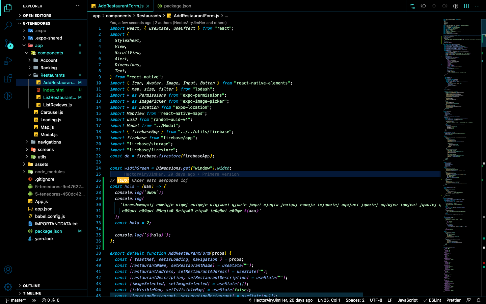

# 🌌 The Night Ocean 🌌

✨ The night ocean is a dark theme for lovers of the sea and northern lights. ✨

See the [CHANGELOG](CHANGELOG.md) for the latest changes.

# The Night Ocean

# Installation

1.  Install [Visual Studio Code](https://code.visualstudio.com/)
2.  Launch Visual Studio Code
3.  Choose **Extensions** from menu
4.  Search for `The Night Ocean`
5.  Click **Install** to install it
6.  Click **Reload** to reload the Code
7.  From the menu bar click: Code > Preferences > Color Theme > **The Night Ocean**

# Feedback

This is my first foray into creating a theme, so if you see something wrong, please feel free to [open an issue](https://github.com/HectorAiryJimHer/the-night-ocean/issues) or better yet, a [pull request](https://github.com/HectorAiryJimHer/the-night-ocean/pulls).! I'm sure there are things I missed.

Any relevant changes for each version are documented in the [changelod](CHANGELOG.md). Please update and check the changelog before filing any issues, as they may have already been taken care of.

# Authors

Authored by [HectorAiryJimHer](https://twitter.com/HectorAiryJimH)
